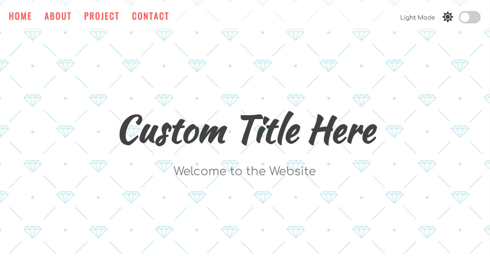
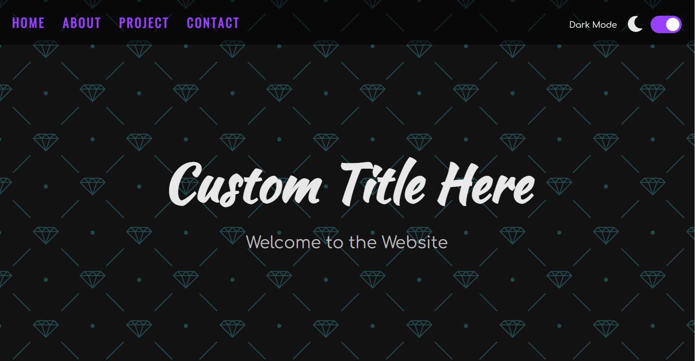

# Light-Dark-Mode  [[Link]](https://prasenjitlightdarkmode.netlify.app/)
Light-Dark Mode ---- A most common feature any modern website usually has nowadays....

HOW IT WORKS:
 * Depending upon whether an user toggle the `switch`, it trigger different states.
 * `event.target.checked` on the input element gives us whether the toggler is checked or not.
 * Now we need to set two different color scheme for dark-light mode. One on the `root` element using `:root`
   pseudo selector and another for dark theme using `data-` attribute.
 * It's vey important to set all these attributes at the highest level of the HTML document. [Learn More](https://developer.mozilla.org/en-US/docs/Web/API/Document/documentElement).
 * At last we use browser's `localStorage` to save the mode of theme. So that even if an user refreshes the
   page, the mode of the theme does't get changed!.

SCREENSHOTS:

